# Organoid Analyst 
*Statistical analysis of the Forskolin-Induced Swelling (FIS) assay*

<br/><br/>

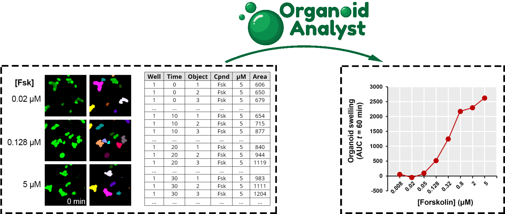


## Table of Contents
* [1. Overview](#overview)
* [2. Statistical background](#background)
* [3. Setup](#installation)
    * [3.1. Windows](#installation-windows)
    * [3.2. macOS](#installation-macos)
* [4. Running Organoid Analyst](#running)
* [5. Demonstration dataset](#dataset)
* [6. Analysis of a demonstration dataset](#analysis)
* [7. Online documentation](#documentation)
* [8. Troubleshooting](#troubleshooting)
* [9. Citation](#citation)
* [10. References](#references)


## <a name="overview">1. Overview</a>

The [forskolin-induced swelling (FIS) assay](#references) is a microscopy-based live cell assay which assesses the efficacy of established and investigational CFTR-modulating compounds for individuals that suffer from cystic fibrosis (CF) [[1](#ref01)].

Organoid Analyst is an R shiny web application for the statistical analysis of FIS data, enabling:
* Interactive data inspection
* Image visualization (*via* [Fiji](http://fiji.sc/))
* Per-object and per-well quality control
* Plotting
* Data normalization
* Generation of publication-ready datasets


## <a name="background">2. Statistical background</a>


Within Organoid Analyst, data normalization uses the following algorithm:
1. Sum the area of all organoids in each image  
2. Compute kinetic curves for each well: total organoid area _vs_ time  
3. Normalize kinetic curves (Area in the first time point = A₀ = 100%)  
4. Compute the area under the curve of the normalized kinetic curves (baseline = 100%)  
5. Export the following measurements (mean, standard deviation, count and SEM):  
    - **AUC (area under the curve):** calculated between the first and the last time points of the experiment (usually: 0 and 60 min).
    - **ISR (initial swelling rate):** the slope of a line fitted to the region of maximal linear swelling as measured in the normalized kinetic curves.
    - **Aₜ/A₀:** normalized area value at the final time point of the FIS assay (Aₜ), using normalization factor A₀ = 100%.


        <p align="center">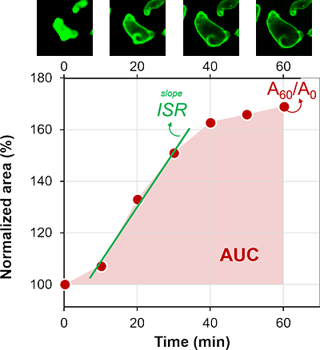</p>


        _Graphical representation of the three FIS outputs generated by Organoid Analyst: AUC, ISR and Aₜ/A₀. Notice the  ~10 min lag between CFTR stimulation at the beginning of the assay (t = 0 min) and the linear swelling region where ISR is measured (t = 10 ~ 30 min)._


## <a name="installation">3. Setup</a>


Organoid Analyst is a web application that runs in a web browser, powered by an R back-end.
Follow the installation proedure that applies to your operating system. Installation only needs to be performed on the first time you run Organoid Analyst on a given computer.  
The [troubleshooting](#troubleshooting) section contains fixes for the most common installation problems.


### <a name="installation-windows">3.1. Windows</a>

1. A **Web browser** must be installed.

2. **R**: Download R from the [CRAN website](https://cran.r-project.org/) and install it.

3. **Fiji**: Dowload from [here](http://fiji.sc/) and unzip.

4. **Install R packages**: Open R. In the R console, next to the `> |` prompt, type the following:

```
source("https://raw.githubusercontent.com/hmbotelho/organoid_analyst/master/installer.R")
runGitHub("organoid_analyst", "hmbotelho", launch.browser=T)
```

Hit enter/return after each line to execute the command.
If prompted, select a folder in your computer and a CRAN mirror.

*Tested with R version 4.0.3 running under Windows 10 Home version 2004, build 19041.508 (32 and 64bit)*


### <a name="installation-macos">3.2. macOS</a>

1. A **Web browser** must be installed.

2. **R**: Download R from the [CRAN website](https://cran.r-project.org/) and install it.

3. **Install the Command Line Tools for Xcode:** Download and install the latest version matching your macOS version from [here](https://developer.apple.com/download/more/?=command%20line%20tools) (Apple ID required).

4. **Fiji**: Dowload from [here](http://fiji.sc/), unzip and move into the Applications folder.

    Check whether you can run Fiji. Should you not, please check the [troubleshooting](#troubleshooting) section.

5. **Install R packages**: Open R. In the R console, next to the `> |` prompt, type the following:

```
source("https://raw.githubusercontent.com/hmbotelho/organoid_analyst/master/installer.R")
runGitHub("organoid_analyst", "hmbotelho", launch.browser=T)
```

Hit enter/return after each line to execute the command.
If prompted, select a CRAN mirror.
If asked `Do you want to install from sources the package which needs compilation?` write `Yes` or `y`

The Organoid Analyst installation was successfully tested in the following environments:

|      **OS version**       | **R version** | **Command Line Tools version** |
|:-------------------------:|:-------------:|:------------------------------:|
|    macOS 10.15 Catalina   |     4.0.3     |              11.5              |
|     macOS 10.14 Mojave    |     4.0.3     |              8.3.2             |
| macOS 10.13.6 High Sierra |     4.0.3     |              8.3.2             |
|     macOS 10.12 Sierra    |     3.6.3     |              8.3.2             |
|   OS X 10.11 El Capitan   |     3.5.3     |               7.3              |

*Organoid Analyst is not compatible with older macOS/OS X versions.*


## <a name="running">4. Running Organoid Analyst</a>

1. Open R.
2. In the console, next to the `> |` prompt, type:

```
library(shiny)
runGitHub("organoid_analyst", "hmbotelho", launch.browser = T)
```

3. Organoid Analyst should open in the default web browser:


<p align="center">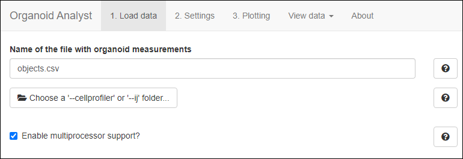</p>


## <a name="dataset">5. Demonstration dataset</a>

A demonstration dataset is provided [here](https://github.com/hmbotelho/FIS_analysis/tree/master/demo_dataset).

**Assay description**  
The FIS assay was performed using intestinal organoids homozygous for a class II CFTR mutation in the absence (DMSO) or presence of VX-809 and/or VX-770 (3.2 μM), as previously described [[2](#ref02)]. CFTR was activated by addition of forskolin (Fsk) in a concentration range from 0.008 μM – 5 μM. The layout of the assay plate is depicted below.

<p align="center">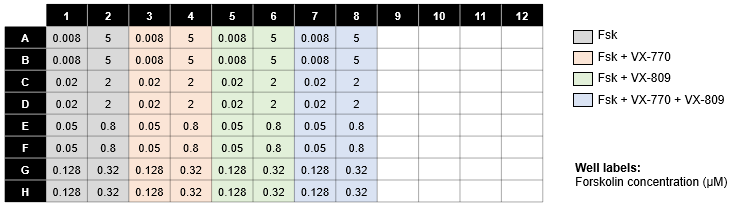</p>

These are the main characteristics of the microscopy images in the demonstration dataset:

- __Imaging system:__ Zeiss confocal microscope
- __Number of plates:__ 1
- __Number of wells:__ 64
- __Number of imaging fields per well:__ 1
- __Number of raw images:__ 448
- __Number of timepoints:__ 7
- __Time interval between frames:__ 10 min
- __Total experiment time:__ 60 min
- __Image resolution:__ 512 x 512 pixels  
- __Pixel dimensions:__ 4.991 x 4.991 μm
- __Image bit depth:__ 8 bit
- __Number of fluorescence channels:__ 1 (calcein green)

The demonstration dataset is comprised of:
1. [**Raw microscopy images**](https://github.com/hmbotelho/FIS_analysis/tree/master/demo_dataset/03-images_renamed/demoplate_01) (91.8 MB)
2. [**Image quantification: object-level area measurements**](https://github.com/hmbotelho/FIS_analysis/tree/master/demo_dataset/05-images_analysis/demoplate_01--cellprofiler) (14.8 MB)
3. [**Analysis of the demonstration dataset with Organoid Analyst**](https://github.com/hmbotelho/FIS_analysis/tree/master/demo_dataset/05-images_analysis/demoplate_01--cellprofiler--analysis) (37.0 MB)


Image analysis was performed with a [pipeline from CellProfiler 3.1.9](./CellProfiler_pipeline).


## <a name="analysis">6. Analysis of a demonstration dataset</a>

Organoid Analyst is designed to analyze data from one plate at a time.

1. Run Organoid Analyst by typing the following on the R console:

```
library(shiny)
runGitHub("organoid_analyst", "hmbotelho", launch.browser = T)
```

2. Organoid Analyst will open in a new browser window
    
    <p align="center"></p>

3. The numbered items at the top navigation bar define the sequential steps involved in data analysis: loading data, specifying analysis settings, plotting and exporting results.

4. Under `1. Load data`, click on `Choose a '--cellprofiler' or '--ij' folder...` and select the [folder](https://github.com/hmbotelho/FIS_analysis/tree/master/demo_dataset/05-images_analysis/demoplate_01--cellprofiler) `demoplate_01--cellprofiler` from the demonstration dataset.

    <p align="center">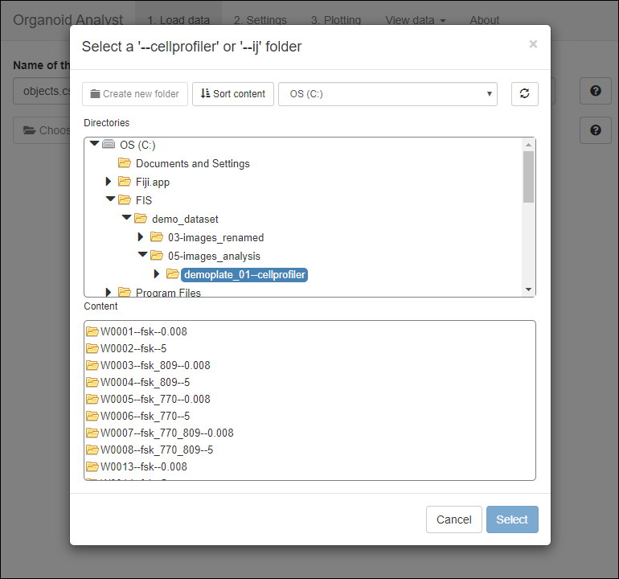</p>

5. Organoid Analyst will concatenate the `objects.csv` files (one per well) generated during the image analysis process. This will generate a data table containing all data from the experiment. 

6. The raw data table can be inspected by clicking `View data > Raw data table (concatenated)`.

    <p align="center">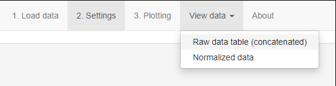</p>

7. Each row in the table represents a single organoid in a single image. Each column represents one feature (measurement or metadata).

    <p align="center">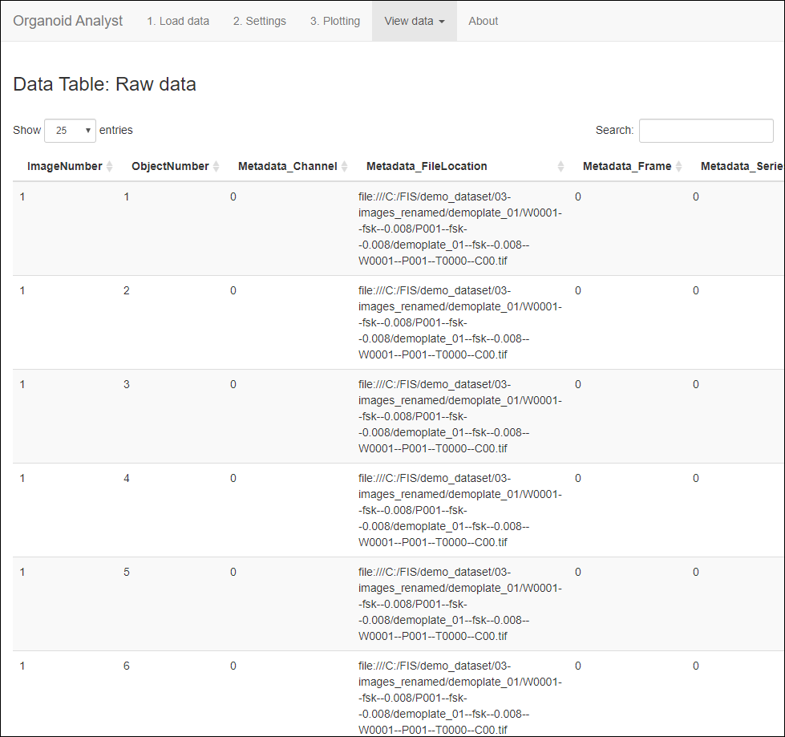</p>

8. Click on `2. Settings`.

9. In this section, inform Organoid Analyst of which columns in the data table contain relevant data (_e.g._ organoid area), as well as of the type of multi well plate used in the experiment, quality control information and file locations:

    * **Experiment Settings:** names of columns containing the experiment metadata and the time resolution of the experiment.

    * **Quality Control Settings:** Coordinates of organoid centroids and labels of organoids which should not be considered in the analysis. In the demonstration dataset, organoids which are not tracked during the entire time lapse (*e.g.* organoids which touch and become insistinguishable of each other) were assigned the label `NaN` in column `TrackObjects_Label_4`. This annotation can be used to exclude those organoids from analysis.

    * **File Remapping Settings:** This module enables opening raw images, even if their location is not the same as when they were analyzes (*e.g.* when image quantification and data analysis are performed on different computers). In order for this to be possible, the user must provide the location of the [raw image folder](https://github.com/hmbotelho/FIS_analysis/tree/master/demo_dataset/03-images_renamed/demoplate_01) in the computer that performed the image analysis and in the computer running Organoid Analyst. Whenever the file remapping settings are correct, a **`Found file!`** notice will be shown. See the table below for an example.

    * **Segmentation Masks Settings:** Determines whether segmentation masks should be updated according to the quality control parameter defined above.

    * **Interaction with Fiji Settings:** The location of the Fiji / ImageJ executable file of the computer running Organoid Analyst. Only required for Windows and not for MacOS.
    
    Below are the settings which were used to analyze the demo dataset.


    | **Parameter**                                  | **Value**                                                         |
    |------------------------------------------------|-------------------------------------------------------------------|
    | **Experiment Settings**                        |                                                                   |
    | _Time resolution (minutes per timepoint)_      | 10                                                                |
    | _Name of the column with AREA values_          | Math_area_micronsq                                                |
    | _Name of the column with TIME values_          | Metadata_timeNum                                                  |
    | _Name of the column with WELL values_          | Metadata_wellNum                                                  |
    | _Name of the column with COMPOUND names_       | Metadata_compound                                                 |
    | _Name of the column with CONCENTRATION values_ | Metadata_concentration                                            |
    | _Number of rows_                               | 8                                                                 |
    | _Number of columns_                            | 12                                                                |
    | **Quality Control Settings**                   |                                                                   |
    | Name of the column with organoid ID            | TrackObjects_Label_4                                              |
    | ID of invalid organoids                        | Allow all organoids                                               |
    | Name of the column with organoid center (X)    | AreaShape_Center_X                                                |
    | Name of the column with organoid center (Y)    | AreaShape_Center_Y                                                |
    | **File Remapping Settings**                    |                                                                   |
    | Column with file path                          | Metadata_FileLocation                                             |
    | Image root folder name in table                | file:///C:/FIS                                                    |
    | Image root folder name in this computer **[¹](#t1_1)**  | C:\FIS                                                   |
    | **Segmentation Masks Settings**                |                                                                   |
    | Generate segmentation masks?                   | Yes                                                               |
    | Image root folder name in table                | file:///C:/FIS/demo_dataset/03-images_renamed/demoplate_01        |
    | Image root folder name in this computer **[²](#t1_2)**  | C:\FIS\demo_dataset\05-images_analysis\demoplate_01--cellprofiler |
    | Length of image suffix  **[³](#t1_3)**         | 9                                                                 |
    | Suffix for segmentation mask files             | --masks.png                                                       |
    | Suffix for Organoid Analyst masks file         | --OAmask                                                          |
    | Suffix for Organoid Analyst labels file        | --OAlabel                                                         |
    | **Interaction with Fiji Settings**             |                                                                   |
    | Path to Fiji (Windows) **[⁴](#t1_4)**          | C:/Fiji.app/ImageJ-win64.exe                                      |

_**<a name="t1_1">¹</a>** Select the [folder](https://github.com/hmbotelho/FIS_analysis/tree/master/demo_dataset/03-images_renamed/demoplate_01) containing the raw microscopy images on your computer (`demoplate_01` in the demonstration dataset)._  
_**<a name="t1_2">²</a>** Select the location of the `demoplate_01--cellprofiler` [folder](https://github.com/hmbotelho/FIS_analysis/tree/master/demo_dataset/05-images_analysis/demoplate_01--cellprofiler) in your computer._  
_**<a name="t1_3">³</a>** The length of the file name termination which differs from raw images to the segmentation masks. Example: In the demonstration dataset, raw microscopy files are named like `demoplate_01--fsk--0.008--W0001--P001--T0000--C00.tif` and segmentation masks are named like `demoplate_01--fsk--0.008--W0001--P001--T0000--masks.png`. The last **9** characters in the raw file names (`--C00.tif`) are the mentioned suffix._  
_**<a name="t1_4">⁴</a>** Select the location of the Fiji executable file on your computer. Not required when running macOS._  


10. Click on `Normalize data`.

11. Organoid Analyst will exclude all organoids which do not meet the quality control parameter, normalize the data and update the segmentation masks. This may take a few minutes.

12. After normalization has completed, the corresponding data table can be inspected by clicking `View data > Normalized data`:

    <p align="center">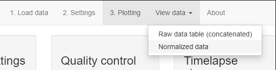</p>

13. Each row in the table represents a whole image (*i.e.* one time frame). Each column represents one feature (measurement or metadata).

    <p align="center">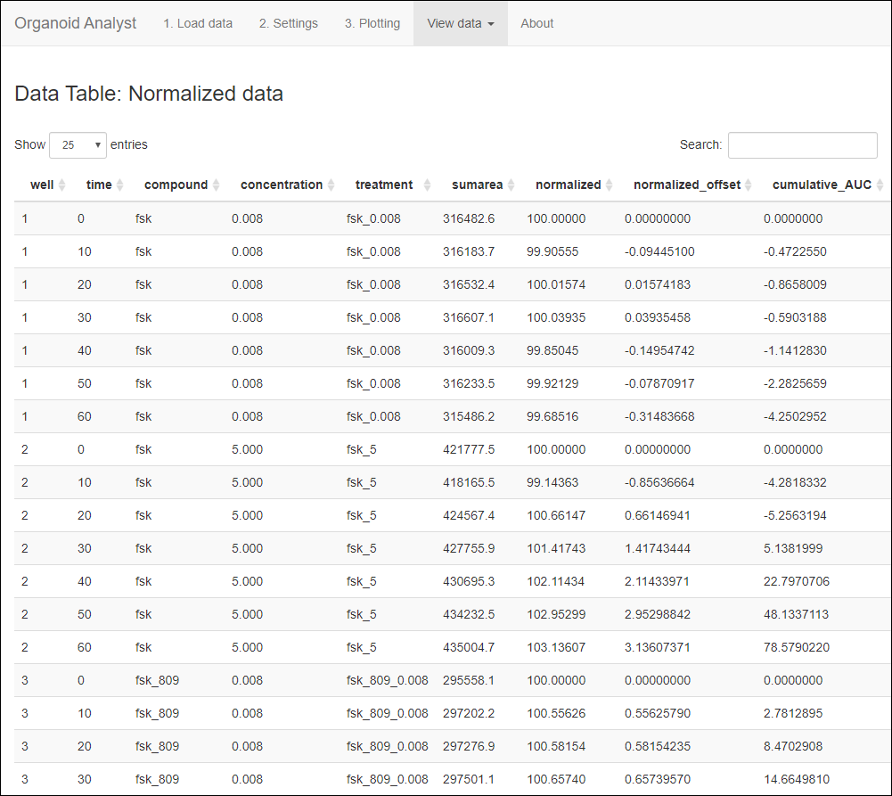</p>
    
14. Click on  `3. Plotting`.

15. This section allows interactive data exploration, image visualization and per well quality control.

    <p align="center">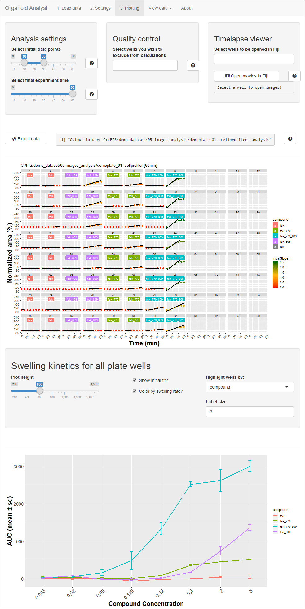</p>

    The following features are available:
    
    * **Analysis settings:** Defines the final time point for the experiment and the time points to be used for the calculation of the initial swelling rate.
        
    * **Quality control:** Allows excluding individual wells from the analysis (_e.g._ wells with imaging aberrations or insufficient organoids). Selected wells will be hidden from all generated plots and summary statistics.
        
    * **Timelapse viewer:** Allows for opening and inspection of an arbitrary number of wells as time lapse sequences in Fiji. Start by selecting the wells of interest and clicking the  button. Fiji will open in a new window as shown below. Raw fluorescence images will be overlaid with segmentation masks and organoid labels from the analyses.
    
    <p align="center">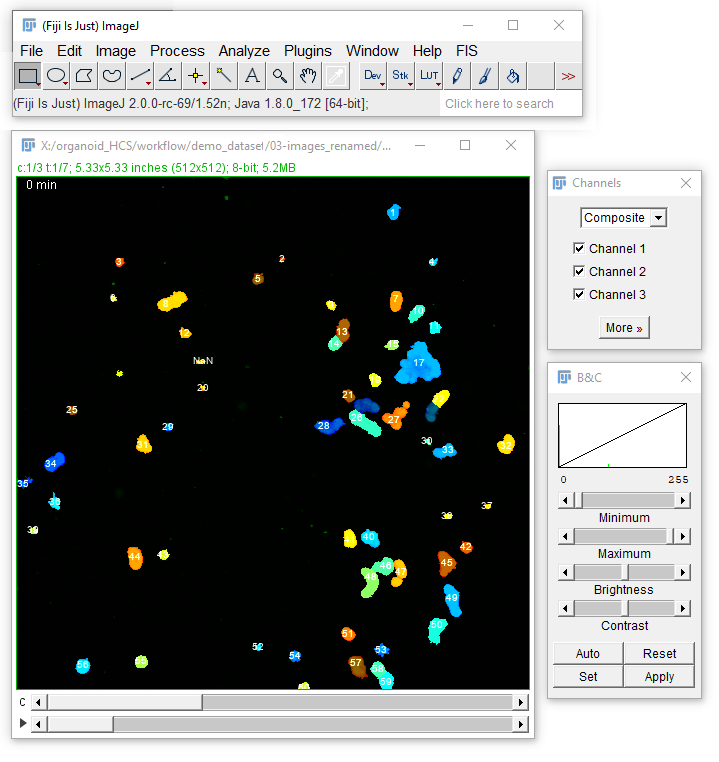</p>
        
    * **Plots:** Organoid Analyst visualizes the quantitative FIS data in five different plots:
    
        * Multi-well plate layout with the normalized kinetic curves being displayed for each well. The plot can also show the ISR.  
    
        * Dose-response plot for AUC measurements. For this plot to be appropriately generated, the infile must contain strictly numerical values for the compound concentration field.
    
        * Bar plots representing summarized AUC, ISR and Aₜ/A₀ measurements (average ± standard deviation, across identically treated wells).  


    The demonstration dataset was analyzed using the following settings:

    | **Parameter**                    | **Value** |
    |----------------------------------|-----------|
    | Select initial data points       | 10 ~ 30   |
    | Select final experiment time     | 60        |
    | Wells excluded from calculations | None      |
    
16. Click the `Export data` button to save the analyzed dataset to the output folder.

17. Organoid Analyst will save the following files:

    * **Updated segmentation masks**
    * **Updated organoid labels**
    * `FIS_normalized.xlsx` Data for individual wells: sum of all organoid areas, normalized areas, normalized areas subtracted of the 100% baseline, and cumulative AUC.
    * `FIS_rawdata.csv` Concatenation of the objects.csv files into a single data table.
    * `FIS_summary_xxmin.xlsx` Per-treatment summary of AUC, ISR and Aₜ/A₀ measurements.
    * `FISanalysis_dd-mm-yy_hh-ss.log` Organoid Analyst settings at the moment of data export.
    * `plot_AtA0_xxmin.png` Bar plot of summarized Aₜ/A₀ measurements.
    * `plot_AUC_xxmin.png` Bar plot of summarized AUC measurements at the final time point of the experiment.
    * `plot_initialswellingrate_xxmin.png` Bar plot of summarized ISR measurements.
    * `plot_overview.png` Plate layout with normalized kinetic curves.
    * `plot_titration_AUC_xxmin.png` Dose-response plot for AUC measurements at the final time point of the experiment.

18. Below are the AUC values determined with the demonstration dataset


| **Compounds**         | **[Fsk] (μM)** | **AUC (mean)** | **AUC (sd)** |
|-----------------------|----------------|----------------|--------------|
| Fsk                   | 0.008          |          16.64 |        29.54 |
| Fsk                   | 0.02           |          -2.07 |        36.18 |
| Fsk                   | 0.05           |          14.76 |         6.87 |
| Fsk                   | 0.128          |         -64.81 |         2.29 |
| Fsk                   | 0.32           |         -29.95 |         1.13 |
| Fsk                   | 0.8            |          -1.88 |        14.57 |
| Fsk                   | 2              |           43.7 |         12.3 |
| Fsk                   | 5              |          47.43 |        44.05 |
| Fsk + VX-770          | 0.008          |          51.47 |         9.07 |
| Fsk + VX-770          | 0.02           |          34.49 |         7.05 |
| Fsk + VX-770          | 0.05           |           5.35 |        24.62 |
| Fsk + VX-770          | 0.128          |            4.7 |        40.07 |
| Fsk + VX-770          | 0.32           |          80.22 |        14.19 |
| Fsk + VX-770          | 0.8            |         359.88 |         12.5 |
| Fsk + VX-770          | 2              |         449.02 |        11.39 |
| Fsk + VX-770          | 5              |          513.1 |         9.65 |
| Fsk + VX-809          | 0.008          |          25.54 |        18.77 |
| Fsk + VX-809          | 0.02           |          72.81 |         8.57 |
| Fsk + VX-809          | 0.05           |         -13.86 |         11.9 |
| Fsk + VX-809          | 0.128          |         -25.36 |        27.24 |
| Fsk + VX-809          | 0.32           |          14.76 |        13.59 |
| Fsk + VX-809          | 0.8            |         171.86 |         5.63 |
| Fsk + VX-809          | 2              |         734.43 |       114.55 |
| Fsk + VX-809          | 5              |        1361.16 |        74.95 |
| Fsk + VX-770 + VX-809 | 0.008          |          30.24 |          4.7 |
| Fsk + VX-770 + VX-809 | 0.02           |           52.6 |        19.01 |
| Fsk + VX-770 + VX-809 | 0.05           |         156.59 |        73.21 |
| Fsk + VX-770 + VX-809 | 0.128          |         477.28 |       238.58 |
| Fsk + VX-770 + VX-809 | 0.32           |        1329.92 |       155.75 |
| Fsk + VX-770 + VX-809 | 0.8            |        2522.41 |        63.19 |
| Fsk + VX-770 + VX-809 | 2              |        2620.19 |       289.62 |
| Fsk + VX-770 + VX-809 | 5              |        2998.54 |       149.31 |

<p align="center">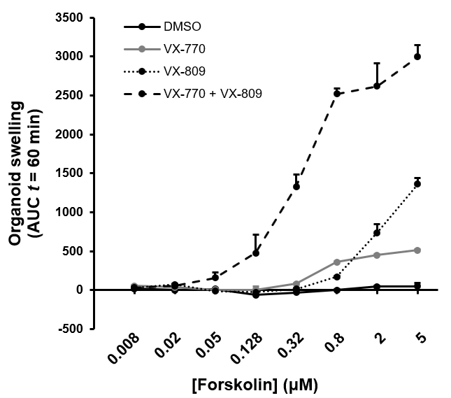</p>


## <a name="documentation">7. Online documentation</a>

Additional information about most features in Organoid Analyst can be obtained in the online help accessible by clicking the  button.


<p align="center">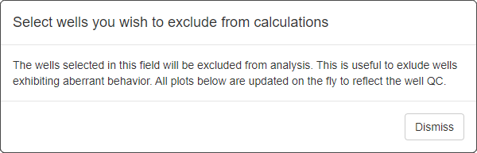</p>


## <a name="troubleshooting">8. Troubleshooting</a>

This section contains fixes for the most common problems one may find when installing or running Organoid Analyst.


**Fiji cannot run (macOS only)**  
If you get the following message when attempting to run Fiji:

`"Fiji" cannot be opened because the developer cannot be verified.`

There are two ways to enable Fiji:

* **Solution 1**: Open the Applications folder, right click Fiji and click `Open`. You should then get the following message: `macOS cannot verify the developer of "Fiji". Are you sure you want to open it?`. Click OK.
    
 * **Solution 2**: Go to `System Preferences > Security & Privacy > General`. Select `Open Anyway` on Fiji.
___


**Packages fail to install**  
If any of the R packages required for Organoid Analyst fails to install one of the following error messages (or similar) will be displayed:

```
Loading required package: raster
Error in library(x, character.only = TRUE) :
  there is no package called 'raster'
```

```
Error: package or namespace load failed for ‘raster’
```

```
ERROR: dependency 'sp' is not available for package 'raster'
```

This means that the package needs to be manually installed with

```
install.packages("raster")
```

Then, run Organoid Analyst with

```
source("https://raw.githubusercontent.com/hmbotelho/organoid_analyst/master/installer.R")
runGitHub("organoid_analyst", "hmbotelho", launch.browser=T)
```

**Note**: Older R versions may not be compatible with the current version of some packages. This may be solved by installing older package versions. To do this find the [package webpage on CRAN](https://cran.r-project.org/web/packages/available_packages_by_name.html), go into the `Old sources` section and get the URL for an older `tar.gz` package file. Then, install it

```
install.packages("https://cran.r-project.org/src/contrib/Archive/xxxx/xxxx_0.0.0.tar.gz", repos=NULL, type="source")
```
___


## <a name="citation">9. Citation</a>
Hagemeijer MC, Vonk AM, Awatade NT, Silva IAL, Tischer C, Hilsenstein V, Beekman JM, Amaral MD, Botelho HM (2020) **An open-source high-content analysis workflow for CFTR function measurements using the forskolin-induced swelling assay** *submitted*


## <a name="references">10. References</a>
<a name="ref01">[1]</a> Dekkers *et al* (2013) **A functional CFTR assay using primary cystic fibrosis intestinal organoids**. *Nat Med* 19, 939-945. [https://doi.org/10.1038/nm.3201](https://doi.org/10.1038/nm.3201)

<a name="ref02">[2]</a> Dekkers *et al* (2016) **Characterizing responses to CFTR-modulating drugs using rectal organoids derived from subjects with cystic fibrosis**. *Sci Transl Med* 8(344), 344ra84. [https://doi.org/10.1126/scitranslmed.aad8278](https://doi.org/10.1126/scitranslmed.aad8278)
